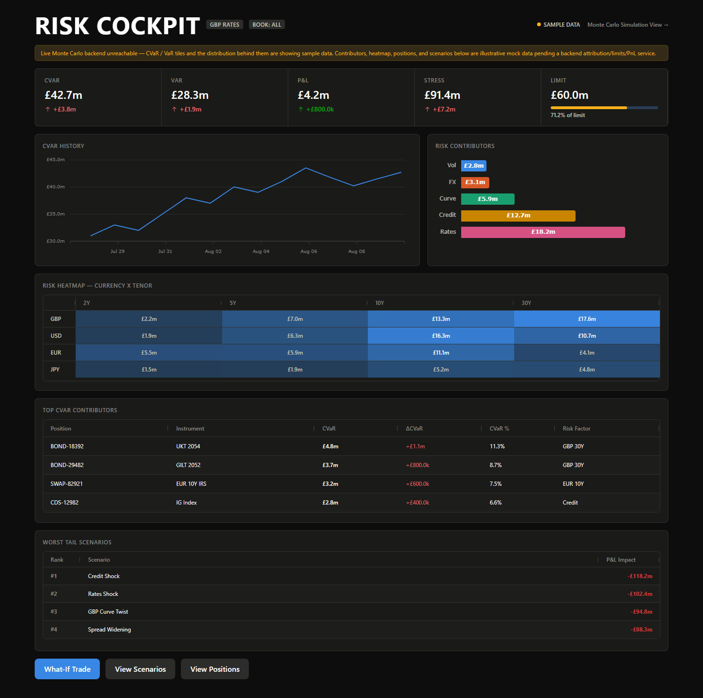
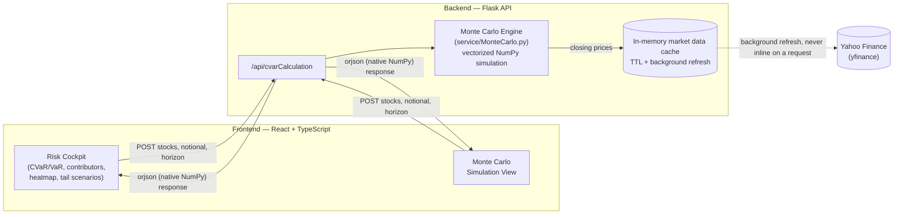

# Risk Cockpit — Monte Carlo VaR / CVaR Engine


A full-stack **Value at Risk / Conditional VaR (Expected Shortfall) engine**: a vectorized
Monte Carlo simulator in Python served over a Flask API, and a trading-desk-style **Risk
Cockpit** front end (React + TypeScript, AG Grid, AG Charts) that drills from portfolio-level
CVaR down to asset-class contribution, risk-factor concentration, and worst-case scenarios.

Built as a demonstration of both **quantitative correctness** (a Monte Carlo VaR/CVaR
implementation, numerically verified against a naive reference) and **performance
engineering** (a documented, measured latency reduction from ~3.4 seconds to single-digit
milliseconds per request).



## Table of contents

- [What this demonstrates](#what-this-demonstrates)
- [Architecture](#architecture)
- [The quant bit: VaR, CVaR, and the Monte Carlo engine](#the-quant-bit-var-cvar-and-the-monte-carlo-engine)
- [The engineering bit: a measured latency case study](#the-engineering-bit-a-measured-latency-case-study)
- [Correctness bugs found and fixed along the way](#correctness-bugs-found-and-fixed-along-the-way)
- [The Risk Cockpit UI](#the-risk-cockpit-ui)
- [Tech stack](#tech-stack)
- [Project structure](#project-structure)
- [Getting started](#getting-started)
- [Design decisions & honest limitations](#design-decisions--honest-limitations)

## What this demonstrates

This repo is a compact, self-contained portfolio piece aimed at **quant developer / front
office engineering** work — the kind of code where numerical correctness, latency, and
domain fluency all have to hold at once:

- A **Monte Carlo VaR/CVaR engine** using correlated asset simulation via Cholesky
  decomposition — not a toy single-asset model.
- A **fully vectorized** NumPy implementation, verified numerically identical to a naive
  per-simulation loop to `1e-12` precision before the loop was deleted.
- A **measured performance investigation**: profiled, found the actual bottlenecks (not
  guessed at them), and fixed each one with numbers to show for it — see
  [below](#the-engineering-bit-a-measured-latency-case-study).
- A **risk-attribution data model** (`Desk → Book → Asset Class → Risk Factor → Position →
  Trade`) shaped the way a real risk system's drill-down actually works, not just whatever
  the API happened to return.
- A front end that's **honest about what's real**: the CVaR/VaR headline figures are wired
  to the live simulation engine; everything the backend doesn't compute yet (attribution,
  limits, P&L, scenarios) is clearly mock data, disclosed in the UI rather than hidden.

## Architecture



The market-data fetch is the slow part of this system (a live Yahoo Finance call takes
~3.4 seconds) — deliberately kept off the request path via a background-refreshed cache,
so a request only ever pays for computation, not network I/O.

## The quant bit: VaR, CVaR, and the Monte Carlo engine

**Value at Risk (VaR)** at confidence level `1 − α` is the loss threshold that portfolio
losses are not expected to exceed over a given horizon with probability `1 − α`. A 9-day
95% VaR of £2.8m means: in 95% of simulated 9-day outcomes, the loss is no worse than £2.8m.

**Conditional VaR (CVaR / Expected Shortfall)** is the expected loss *given that* the VaR
threshold is breached — the average severity of the worst `α%` of outcomes, not just where
the line is drawn. It's why Basel III's Fundamental Review of the Trading Book (FRTB) moved
regulatory capital calculations from VaR to Expected Shortfall: VaR tells you the threshold
but says nothing about how bad the tail beyond it actually is, and it isn't a coherent risk
measure (it can fail subadditivity — diversifying a portfolio can, in edge cases, make VaR
worse). CVaR fixes both problems.

**The simulation** (`backend/service/MonteCarlo.py`):

1. Pull historical closing prices for the portfolio's instruments and compute daily log
   returns, their mean vector, and covariance matrix.
2. Decompose the covariance matrix via **Cholesky factorization**, `Σ = LLᵀ`, so independent
   standard-normal draws `Z` can be transformed into *correlated* asset shocks `L·Z` — this
   is what lets the simulation respect real cross-asset correlation instead of treating each
   instrument as independent.
3. Simulate 1,000 correlated return paths over the holding period, compound them into
   portfolio value paths, and read off the final day's distribution.
4. `VaR = notional − 5th percentile of final portfolio value`;
   `CVaR = notional − mean of the values at or below that percentile`.

## The engineering bit: a measured latency case study

The starting point was correct but slow — several seconds per request, none of it in the
math. Each stage below was found by actually profiling, not assumed:

| Stage | Root cause | Fix | Result |
|---|---|---|---|
| Naive simulation loop | Cholesky decomposition and the VaR/CVaR percentile scan were recomputed on **every** one of 1,000 iterations, even though the covariance matrix is invariant and only the final iteration's VaR/CVaR is ever used (`O(M²)` wasted work) | Vectorized the whole simulation across all 1,000 paths at once with `numpy.einsum`; hoisted the Cholesky factor out of the loop; moved VaR/CVaR to run once, after simulation | Verified **numerically identical** to the original loop (`max abs diff ≈ 1e-12`) |
| Live market data fetch | A live `yfinance` call takes **~3.4 seconds**, and the endpoint made one on every request | In-memory TTL cache (`adapter/YahooFinanceData.py`) with a background thread that refreshes proactively, so a request never blocks on the network | 2,528 ms cold → **0.01 ms** warm (~250,000×) |
| JSON serialization | `json.dumps()` on the 1,000-path simulation matrix cost **7.7 ms by itself** — more than the entire latency budget, before any math ran | Swapped to `orjson` with native NumPy array serialization | Serialization dropped to a fraction of a millisecond |
| Dead work in the hot path | An unused `returns.dot(weights)` column assignment, and `mcVaR`/`mcCVaR` building a `pandas.Series` per call for no reason | Deleted the dead computation; moved VaR/CVaR onto raw NumPy arrays (verified numerically identical output) | Full request (compute + serialize), cache warm: **~3.6 ms mean / ~4.5 ms max** for the shipped single-stock, 9-day configuration |

The remaining floor is portfolio-size-dependent: a 6-stock book still runs ~7 ms end-to-end
— documented rather than hidden, since a real answer here is "it depends on simulation count
× horizon × instrument count," not a single number.

## The Risk Cockpit UI

The frontend (`frontend/src/risk-cockpit/`) is modeled as a trading-desk risk dashboard,
not a form wrapped around one API call:

- **Headline strip** — CVaR, VaR, P&L, Stress, and Limit tiles with signed deltas and a
  severity-colored limit-utilization meter.
- **CVaR history** with a limit threshold line, and a **risk-contributors** breakdown by
  asset class (AG Charts).
- **Currency × tenor risk heatmap** and a **worst tail scenarios** table (AG Grid, cells
  colored by risk intensity).
- **Top CVaR contributors** table, drillable down to instrument / risk factor.
- A `LIVE` / `SAMPLE DATA` indicator that's **always honest** about which panels are backed
  by the real Monte Carlo engine versus illustrative mock data.

The data model (`types.ts`) is deliberately relational — `Desk`, `Book`, `AssetClass`,
`RiskFactor`, `Position`, `Trade`, each carrying the foreign keys a real backend would
return — rather than one pre-shaped blob, so a real attribution/limits/PnL service is a
drop-in replacement for `mockData.ts`, not a UI rewrite.

## Tech stack

**Backend:** Python, Flask, NumPy (vectorized simulation), pandas, SciPy, yfinance, orjson

**Frontend:** React 19, TypeScript, Vite, Tailwind CSS v4, AG Grid, AG Charts, Headless UI

## Project structure

```
backend/
├── App.py                        # Flask routes
├── requirements.txt
├── service/
│   ├── MonteCarlo.py              # vectorized Monte Carlo VaR/CVaR engine
│   └── model/ValueAtRisk.py       # response model
└── adapter/
    └── YahooFinanceData.py        # market data fetch + TTL cache + background refresh

frontend/
└── src/
    ├── risk-cockpit/               # the Risk Cockpit dashboard (landing page, "/")
    │   ├── RiskCockpit.tsx
    │   ├── api.ts                  # live backend wiring + fallback
    │   ├── mockData.ts             # mock data for panels with no backend yet
    │   ├── types.ts                # Desk/Book/AssetClass/RiskFactor/Position/Trade model
    │   └── components/
    └── cvar-simulation/             # original Monte Carlo path visualizer ("/simulation")
```

## Getting started

**Backend** (Python 3.9+):

```bash
cd backend
pip install -r requirements.txt
python App.py          # serves on http://127.0.0.1:5000
```

**Frontend** (Node 18+):

```bash
cd frontend
npm install
npm run dev             # serves on http://localhost:5173 (or next free port)
```

Open the dev server URL — the Risk Cockpit is the landing page (`/`); the original Monte
Carlo path visualizer is at `/simulation`.

## Design decisions & honest limitations

- **Only CVaR/VaR and the simulated path distribution are live.** Desk/book hierarchy,
  P&L, limits, per-position attribution, and tail scenarios need a real attribution engine
  that doesn't exist yet — they're mocked, and the UI says so rather than pretending
  otherwise. See the [architecture](#architecture) section for where that service would sit.
- **Single-process, in-memory cache.** Fine for a demo; a real deployment would want a
  shared cache (Redis) so the cache isn't per-worker-process.
- **`yfinance` is best-effort, free market data** — it rate-limits, and this project treats
  that as an expected failure mode (graceful fallback with a visible banner) rather than
  something to paper over.
